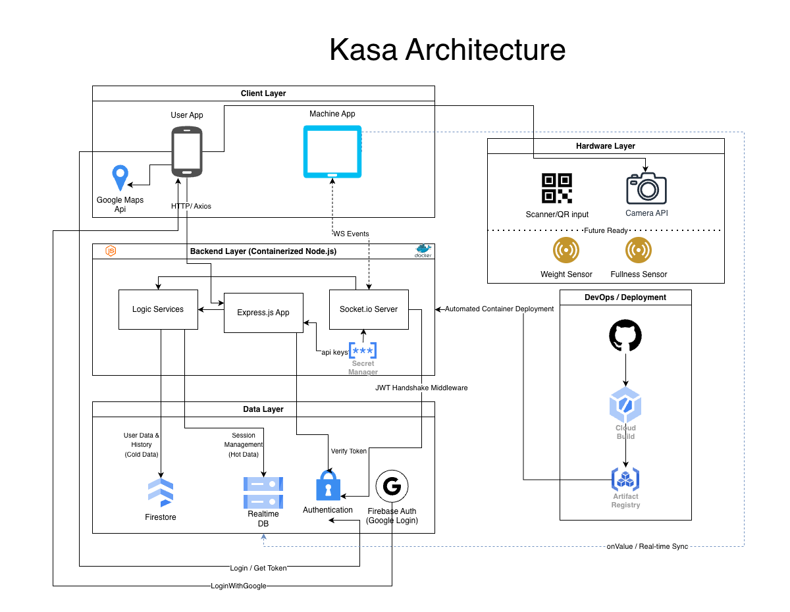

# ♻️ Kasa | Smart Recycling Ecosystem

 
> **Architecture Overview:** A decentralized cloud-native system bridging physical edge interfaces with real-time logic and financial services.

### 🚀 Transforming Bottle Recycling into a Seamless Digital Experience
Kasa is a distributed, cloud-based system designed to revolutionize the bottle recycling industry in Israel.By integrating advanced edge interfaces with real-time communication, the project replaces outdated paper vouchers with secure, instant, and transparent digital credits.

## 💡 The Vision
The recycling process should be as easy as "Scan & Go". Kasa creates a continuous, secure connection (Handshake) between the user and the recycling machine interface, ensuring instant gratification through immediate digital credit.

## ✨ Core Capabilities
* **Real-time Handshake:** Establishes a continuous and secure WebSocket connection between the User App and the Machine Interface for interactive session management.
* **Atomic Financial Integrity:** All transactions are processed as **Atomic Transactions**, ensuring that wallet updates and ledger logging occur as a single, indivisible unit.
* **Hardware-Agnostic Architecture:** Designed as a flexible **Logic Layer**, the system is capable of receiving signals from various sensors, such as weight or volume, without requiring core backend modifications.

## 💡 Implementation Spotlight
While the full source code is private, here are key architectural patterns used to ensure system reliability:

### 1. Atomic Financial Transactions (Firestore)
To prevent race conditions and ensure 100% balance accuracy, Kasa utilizes Firestore's atomic transactions with integer-based calculations to avoid floating-point errors:

```typescript
// Ensuring financial integrity with atomic updates 
await db.runTransaction(async (transaction) => {
  const userRef = db.collection('users').doc(userId);
  const userDoc = await transaction.get(userRef);
  
  if (!userDoc.exists) throw new Error("User not found");

  // Using integer cents to prevent precision issues 
  const newBalanceCents = userDoc.data().balanceCents + amountCents;
  transaction.update(userRef, { balanceCents: newBalanceCents });
  
 // Log entry in the ledger 
  const logRef = db.collection('ledger').doc();
  transaction.set(logRef, { userId, amountCents, timestamp: FieldValue.serverTimestamp() });
});

```

### 2. Real-time Session Synchronization (Socket.io)

Managing isolated rooms for secure, low-latency communication between users and machines:

```typescript
io.on("connection", (socket) => {
  socket.on("user:handshake", ({ machineId }) => {
    const roomId = `session_${machineId}`;
    socket.join(roomId); // Isolated session rooms 
    socket.to(roomId).emit("machine:start_session", { userId: socket.userId });
  });
});

```

## 🛠 Tech Stack

| Layer | Technologies |
| :--- | :--- |
| 📱 **Frontend** | React Native (Expo), TypeScript, Context API, Tanstack Query |
| ⚙️ **Backend** | Node.js (TypeScript), Express, Socket.io, JWT Authentication |
| ☁️ **Cloud & DB** | GCP (Cloud Run, Secret Manager, Firestore, Firebase RTDB |
| 🚀 **DevOps** | GitHub Actions, Docker, Google Cloud Build |

## 📊 Engineering Excellence & Optimization

* 🚀 **Cold Start Mitigation:** Implemented a **Warm-up Call** mechanism to wake the Cloud Run instance upon app launch, ensuring sub-second response times for the initial scan.
* 🔄 **System Resilience:** Developed a **60-second Grace Period** for automatic session recovery, preventing data loss during network fluctuations.
* 📸 **Hardware Resilience:** Integrated specialized hooks to handle hardware-specific camera issues (e.g., Samsung API) via a managed **Hard Restart** flow.
* 💰 **Precision Engineering:** Strictly using **Integer Cents** for all currency operations to eliminate floating-point precision issues.

## 📈 Project Status

The system is currently **Production Ready** , having successfully passed full MVP testing with performance benchmarks of sub-1.5 second response times.

---

Developed by **Roi Meshulam** | May 2026 

```

```
